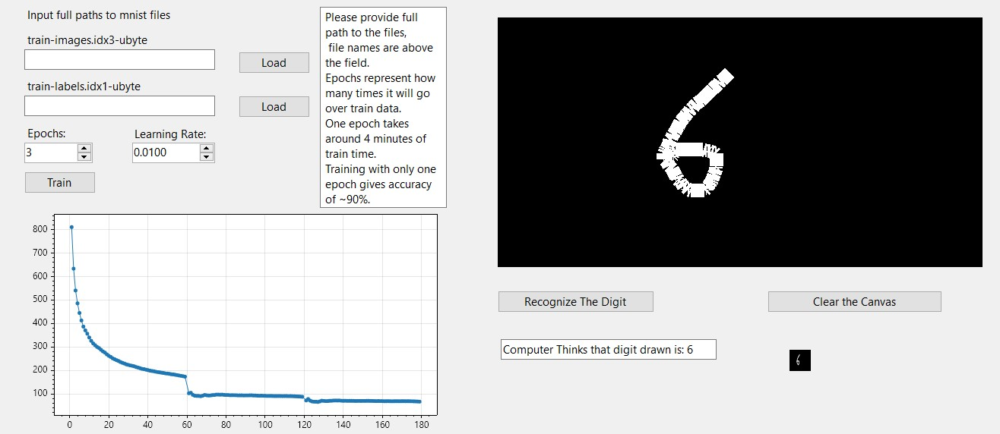

# Digit Recognizer with Custom Neural Network

This project is a digit recognition system built around my previous neural network implementation. It includes a fully functional **handwritten digit classifier** trained on the **MNIST dataset**.

## Features
- 🧠 **Custom-built neural network** 
- 🔄 **Training from scratch** using backpropagation.
- ✍ **Handwriting input** with a **WinForms-based UI**.
- 📊 **Live loss visualization** using ScottPlot.

## Screenshot


## Getting Started
1. Clone this repository:
   ```sh
   git clone https://github.com/Kolic123/NeuralNetworkDigitRecognizer.git

2. Open in Visual Studio and build the project.
3. Run the application and draw digits for recognition.
